Prescription Data Analysis
===
author: Kishore Jagadeesan
date: 16 May, 2019

<!-- NOTE: Styling and external images may be missing --> 

Postdoctoral Research Associate
   
  Department of Chemistry
   
  University of Bath

Outline
===
* Prescription Data Analysis
  * Background
  * Data and Strucutre
  * Data management, aggregation
* Demo - Features
<!-- * Additional Features -->
* Summary

Prescription Data Analysis
===
We aimed to compile and process NHS Digital prescribing data for the period 2014–2018 to facilitate the calculation of the consumption data and long-term time, seasonal and location based trends to create an interactive data visualisation tool for a wider use.

With this interactive tool, we have made it easy to calculate the total quantity of different Active Pharmaceutical Ingredients (APIs) prescribed and to monitor prescribing trends over different spatial and temporal regions.

Background
===

 * To predict the total amount of APIs, released to the environment and to calculate Predicted Environmental Concentration (PEC), information on the manufacturing or consumption is vital.
 * And for certain groups of APIs, assessment of their consumption trends over spatial and temporal regions helps to understand and correlate with various facts like drug abuse and antimicrobial resistance.
 
Data and Strucutre
===

<h4>1. NHS Prescription Dataset</h4>
  * General practice <a href="https://data.gov.uk/dataset/176ae264-2484-4afe-a297-d51798eb8228/gp-practice-prescribing-data-presentation-level" target="_blank"> prescribing data </a> is a list of all medicines, dressings and appliances that are prescribed and dispensed each month.
  * Monthly dataset  ~ 1.3 GB
  * more than 500 million rows
  
  
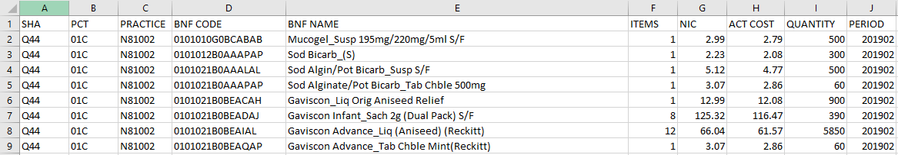NHS Prescription Dataset - Sample

<h4>2. June 2018 BNF SNOMED Mapping document</h4>
  * <a href="https://www.nhsbsa.nhs.uk/prescription-data/understanding-our-data/bnf-snomed-mapping" target="_blank"> BNF / SNOMED mapping data </a>  is published by the NHS Business Services Authority (NHS BSA) and represents mapped data between the <a href="https://www.nhsbsa.nhs.uk/pharmacies-gp-practices-and-appliance-contractors/dictionary-medicines-and-devices-dmd" target="_blank"> Dictionary of Medicines and Devices (dm+d) </a> and the legacy Master Data Replacement (MDR) drug database.
  * The dataset shows one row for every VMPP / AMPP record and a field showing which BNF code this maps to, as in the figure below,
  
  
BNF SNOMED Mapping - June 2018

<h4>3. Dictionary of medicines and devices (dm+d) release files</h4>
  * The <a href="https://www.nhsbsa.nhs.uk/pharmacies-gp-practices-and-appliance-contractors/dictionary-medicines-and-devices-dmd" target="_blank">dm+d </a> is a dictionary of descriptions and codes which represent medicines and devices in use across the NHS.
  * NHS Data Model and Dictionary (NHS dm+d)
    
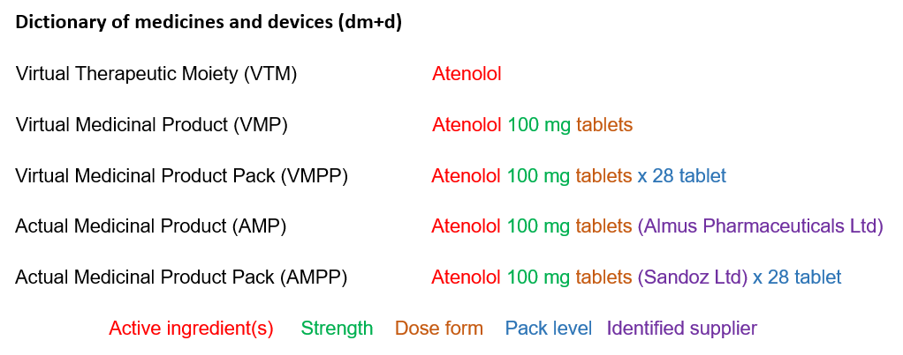Dictionary of medicines and devices (dm+d)

Data management, aggregation - Part 01
===

  * The data from the previously mentioned datasets cannot be directly combined based on different APIs. Thus, they neither facilitate the calculation of the consumption data nor the assessment of seasonal or location based trends.

  * Data aggregation and interactive tool development was implemented entirely <a href = "https://www.r-project.org/in" target="_blank"> R</a>, using <a href = "https://www.rstudio.com/" target="_blank"> Rstudio </a>and the <a href = "https://shiny.rstudio.com/" target="_blank">shiny </a> framework. <a href = "https://www.rstudio.com/" target="_blank">Rstudio</a> is an open-source interface for the development of R applications, and <a href = "https://shiny.rstudio.com/" target="_blank">shiny</a> is a package that allows the creation of web applications directly from R. The other packages used in the data handling and visulaisation are  <a href = "https://cran.r-project.org/web/packages/shinydashboard/" target="_blank"> shinydashboard</a>, <a href = "https://cran.r-project.org/web/packages/data.table/" target="_blank"> data.table</a>, <a href = "https://cran.r-project.org/web/packages/tidyr/" target="_blank"> tidyr</a>, <a href = "https://cran.r-project.org/web/packages/reshape2/" target="_blank"> reshape2</a>, <a href = "https://cran.r-project.org/web/packages/leaflet/" target="_blank"> leaflet</a> and <a href = "https://cran.r-project.org/web/packages/plotly/" target="_blank"> plotly</a>.

  * All data were grouped by BNF code, by matching and combining the tables generated from BNF SNOMED Mapping file (June 2018) and NHSBSA dm+d weekly release files. The flow chart below explains the matching and combining of the different tables generated from the above mentioned files.
  

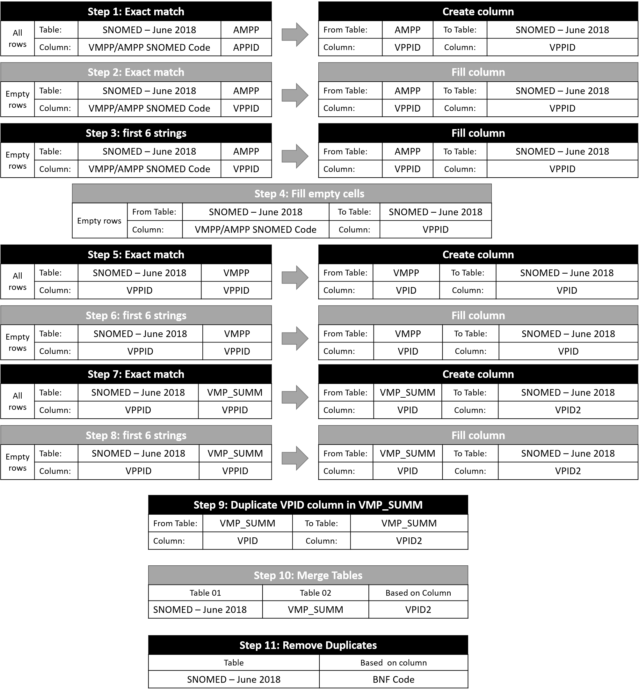BNF Code matching process flow chart

  
  * 
Tables mentioned in the flow chart are generated from following files:

      <table cellpadding="15">
  <tr>
    <th>Table</th>
    <th>Files</th>
  </tr>
  <tr>
    <td>SNOMED – June 2018</td>
    <td>  BNF SNOMED Mapping file - June 2018</td>
  </tr>
   <tr>
    <td>AMPP</td>
    <td>  dm+d file: f_ampp.xlsx</td>
  </tr>
  <tr>
    <td>VMPP</td>
    <td>  dm+d file: f_vmpp.xlsx</td>
  </tr>
  <tr>
    <td>VMP</td>
    <td>  dm+d file: f_vmp.xlsx</td>
  </tr>
  <tr>
    <td>VMP_SUMM</td>
    <td>  modified from VMP table</td>
  </tr>
   
</table>

Data management, aggregation - Part 02
===

  * The final "SNOMED – June 2018" table is matched with the NHS prescription dataset file to generate result based on the user inputs in the tool.
  * For the region/catchment based selection, GIS region/catchment shape files and postcodes with latitude/longitude coordinates files were utilized. The files are used from open source repositories and research partners.
  * <a href = "https://cran.r-project.org/web/packages/leaflet/" target="_blank"> leaflet</a>,<a href = "https://cran.r-project.org/web/packages/rgdal/" target="_blank"> rgdal</a>,<a href = "https://cran.r-project.org/web/packages/sp/" target="_blank"> sp</a>,<a href = "https://cran.r-project.org/web/packages/data.table/" target="_blank"> data.table</a>,<a href = "https://cran.r-project.org/web/packages/tidyr/" target="_blank"> tidyr</a> packages are utilized for the reading and selection of shape files, and data aggregation part.
  
Prescription Data Analysis - Demo
===

https://jkkishore85.shinyapps.io/PDA_1_0/

Demo - Login Page
===
* Login page to restrict users

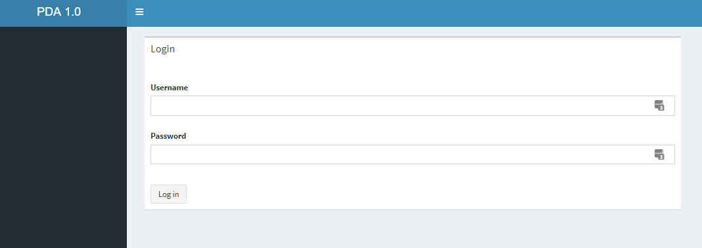Login Page - June 2018

Demo - Front page
===

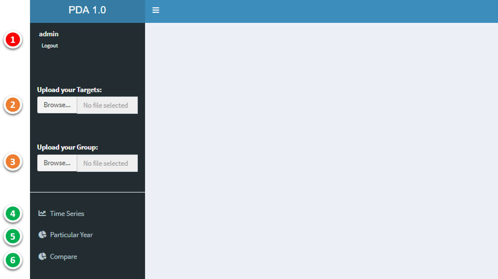Front Page

##### 1 - User Identification
##### 2, 3 - Input files
##### 4,5,6 - Different View Options

Demo - Input files
===

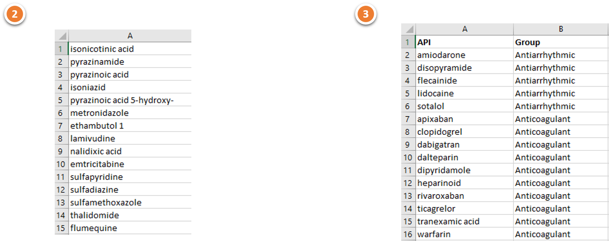Input files

#####  2 - Target APIs list in .csv format
#####  3 - Grouping of APIs based on the chemical class in .csv format. This can be modified based on the usage of data.

Demo - Time series
===

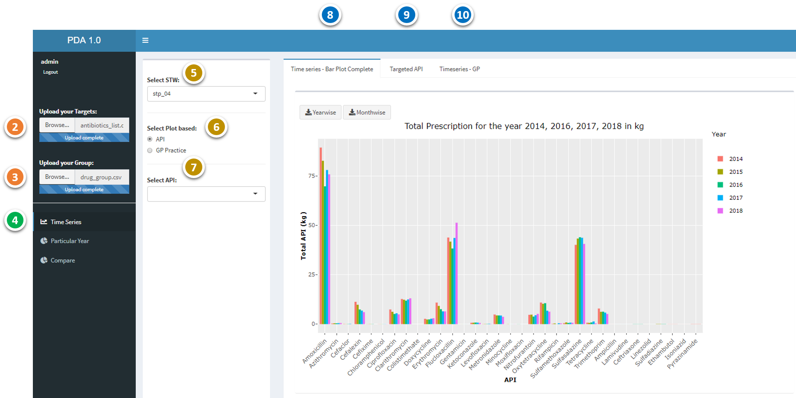Time series - Option

#####  5 - Select the STP catchment area
#####  6, 7 - Options to see the trends based on a target API or GP surgery (Options 9 and 10)
#####  8 - Display the total prescription data for the year 2014-2018 in kg (For all API from the Target list )
#####  9 - Display the total prescription data for the year 2014-2018 in kg (For a particular target API)
#####  10 - Display the total prescription data for the year 2014-2018 in kg (For a particular target GP surgery)

Demo - Time series
===

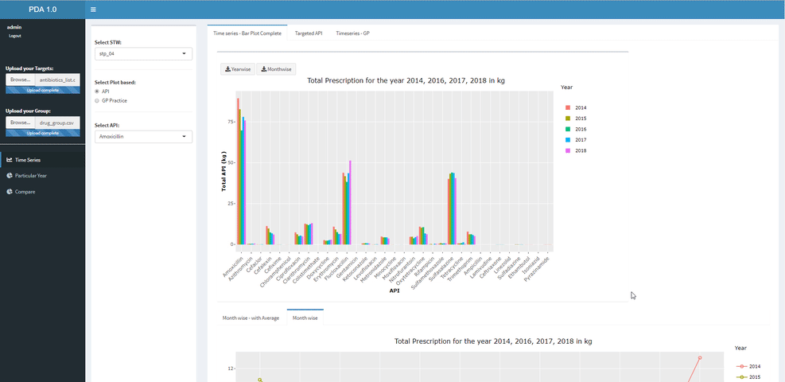Time series - Demo

 * By selecting the API in the barplot, we able to see the trend of the API over the period
 * Download buttons helps to download the data in .csv files
 
Demo - Targeted API
===

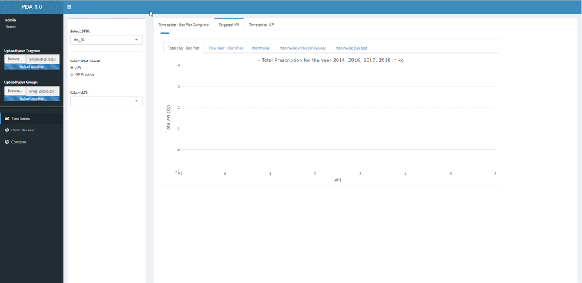Targed API - timeseries - Demo

 * By selecting the API in the dropdown, we able to see the trend of the API over the period

Demo - Timeseries GP
===

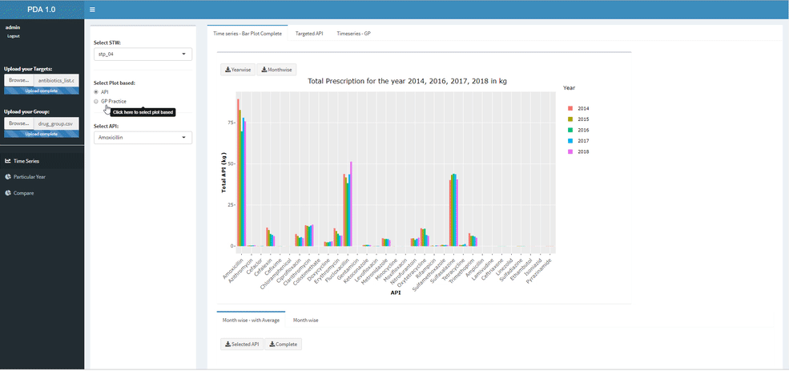Targed GP - timeseries - Demo

 * To see the trend of the API over the period with respective to different GP practice in the particular STP catchment area
 * Working on getting the trend of different APIs over the selection of targeted GP practice

Particular year
===

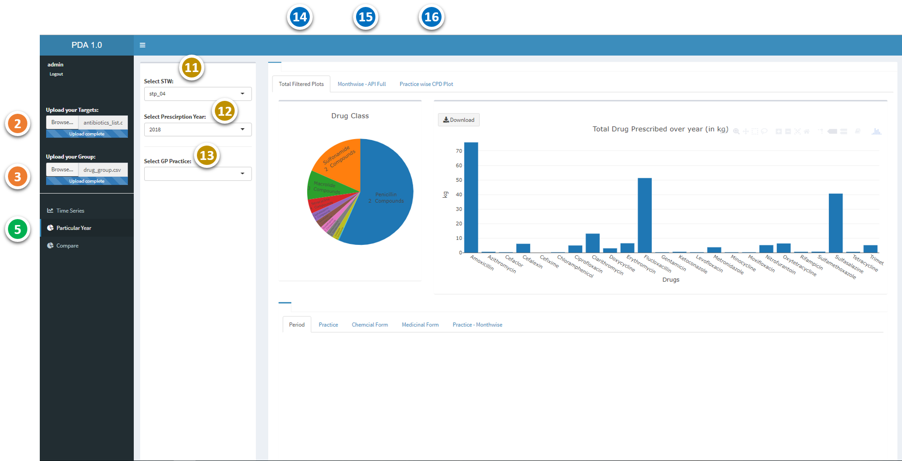Particular Year - Option

#####  11 - Select the STP catchment area
#####  12 - Select the year of interest
#####  13 - Select the targeted GP of interest (for the option 16)
#####  14 - Display the total prescription data for the selected year in kg (For all API from the Target list )
#####  15 - Display the total prescription data per month for the selected year in kg (For all API from the Target list )
#####  16 - Display the total prescription data on targted GP for the selected year in kg (For all API from the Target list )

Demo - Particular year
===

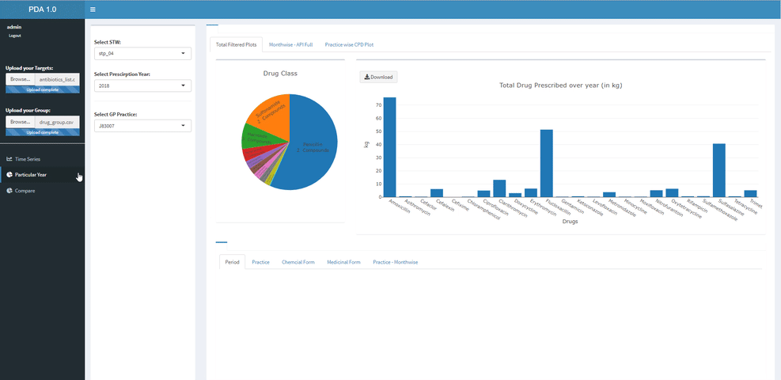Particular Year - Demo

  * By selecting the API in the barplot, we able to see the trend of the API over,
    * Period
    * GP Practice - Total
    * Chemical form
    * Medicinal form
    * GP Practice - Monthwise
    
Demo - Monthwise APIs
===

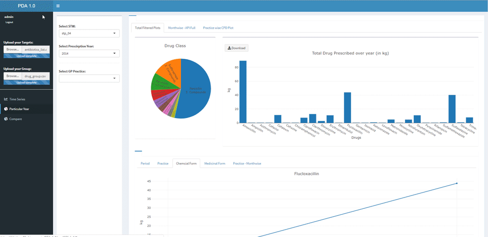Monthwise APIs - Demo

* By selecting the year in the dropdown, we able to see the monthwise trend of all APIs for a particular STP

Demo - Monthwise GP
===

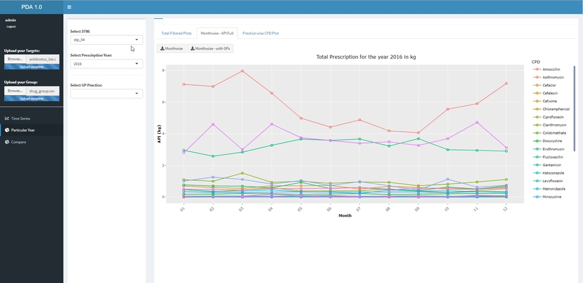Monthwise GPs - Demo

* By selecting the GP Practice code in the dropdown, we able to see the monthwise trend of all APIs for a particular GP

Compare STW
===

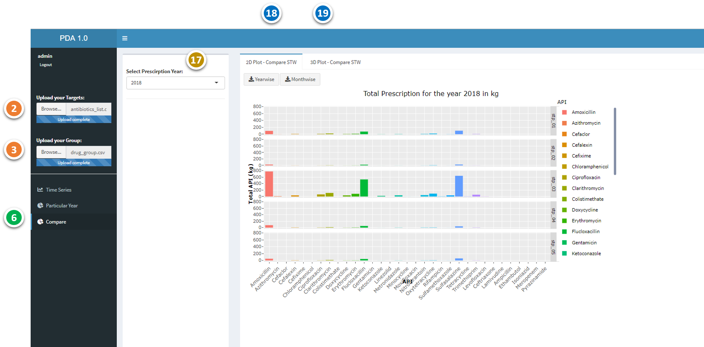Compare STW - Option

#####  17 - Select the year of interest
#####  18 - Comparison of the APIs for the selected year - 2D Plot 
#####  19 - Comparison of the APIs for the selected year - 3D Plot

Demo - Compare STW - 2D plot
===

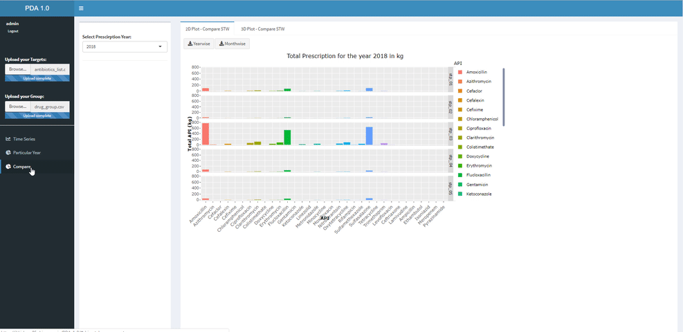Compare STW - 2D Plot - Demo

* By selecting the year in the dropdown, we able to see the year wise trend of all APIs for different STPs

Demo - Compare STW - 3D plot
===

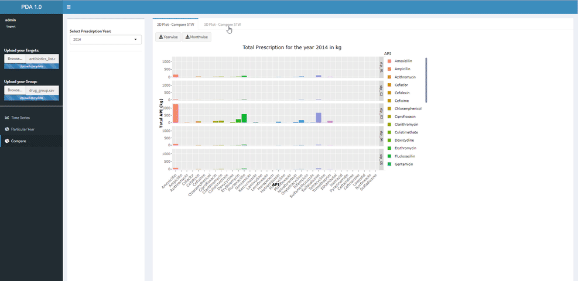Compare STW - 3D Plot - Demo

* By selecting the year in the dropdown, we able to see the year wise trend of all APIs for different STPs

<!-- Additional Features - Heatmap -->
<!-- === -->

<!--  -->

<!-- #####  20 - Data with total APIs   -->
<!-- #####  21 - Select API  -->
<!-- #####  22 - Select Year -->
<!-- #####  23 - Heatmap Tab -->

<!-- Additional Features - Pie Chart -->
<!-- === -->

<!--  -->

<!-- #####  20 - Data with total APIs   -->
<!-- #####  21 - Select API  -->
<!-- #####  22 - Select Year -->
<!-- #####  24 - PieChart Tab -->

Summary
===

 * The tool helps to calculate the consumption data for different APIs over the time period 2014-2018
 * Also helps in the assessment of consumption trends over spatial and temporal regions, which are interesting for a number of applications
 * It has present limitation in calculation the quantity of the APIs prescribed as ‘solution for injection’
 
