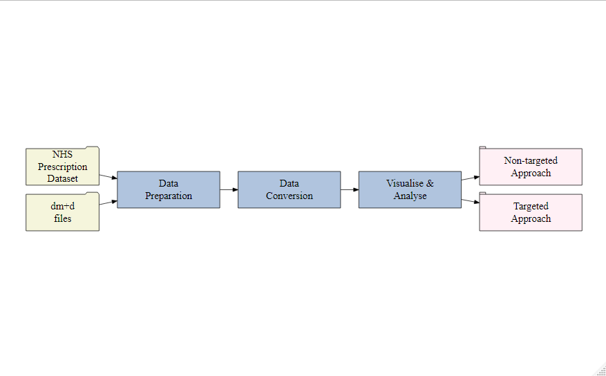

---
output:
  word_document: default
  pdf_document:
    fig_caption: yes
    latex_engine: xelatex
  html_document: default
---
# Workflow {#workflow}

The workflow in this tutorial consists of the following steps, as in the Figure: \@ref(fig:prana-workflow):

- **Data Preparation**: Download monthly [NHS prescription datasets][NHSBSA] and Dictionary of medicines and devices release files [(dm+d)][dm+d].
- **Data Conversion**: Aggregation and conversion of the locally stored datasets into practice wise dataset achieved using the functions in `PrAna`.
- **Visualise and Analyse the data**: Visualise and analyse the processed dataset using the in-built ShinyApp `PrAnaViz`.
- **Database service**: Linking of the processed dataset to the `PrAnaViz` can be achieved by uploading the processed dataset to a local or a remote database service, for example, [_MySQL._][MySQL]
- **Download images and processed data**: Users can download processed data as **_.csv_** file and publication ready image **_.eps_** and **_.pdf_** files.


```{r prana-workflow, echo=FALSE, out.width='80%', fig.align='center', fig.fullwidth=TRUE, fig.cap='PrAna Workflow.'}

```


## Data Preparation {#datapreparation}

To download NHS prescription datasets, users need to guest login and solve a captcha in [NHSBSA information portal][NHSBSA], to download the [dm+d][dm+d] release files and [_dm+d XML Transformation Tool_][dm+d2], users need to register an account.

Store the monthly NHS prescription data in year wise folder. For an example, store all the 2015 monthly datasets in a folder named '2015'. Extract the _dm+d release files_ using _dm+d XML Transformation Tool_. The documentation to extract the release file using the tool is well explained in the readme file.


## Data Conversion

Different functions were used in the aggregation and conversion workflow behind the scenes that performs the heavy lifting of a workflow step and finally return the results. 

An overview of all functions involved in the data conversion is shown in the table below.

Function         | Remarks
-----------------| ----------------------------------------------
`csv2dat()`   | Combine and convert all the comma separated value (.CSV) files in the defined file path and export it into a single R object
`importdmd()`  | Import dm+d files and link it to the BNF code using the SNOMED mapping file
`practice_wise()` | Import NHS dataset files and generate processed individual GP practice prescription dataset
`runShiny()` | Run in-built Shiny Apps in the package

### Combine NHS monthly dataset

`csv2dat()` function supports to combine different monthly NHS prescription dataset files into a single `data.frame` to process further. For an example:

```
## Load library
library(PrAna)

## Set the folder to store the combined file
setwd("C:/Datasets/2018")

## Combine and convert mulitple files in the defined folder to a dataframe
data201812 <- csv2dat("C:/Datasets/Prescription Datasets/2018/PDPI")

```

### Import `dm+d` files

`importdmd()` function \@ref(example1) helps to import different extracted [`dm+d files`] [#dataextraction] and return multiple data objects  including a `data.frame` which map each BNF code to its corresponding API(s), strength and medicinal form. Recommended to read the documentation of `importdmd()` function to know more regarding the different data objects it generate.

```
## Read the extracted dm+d files
dmdfile  <- importdmd("C:/dmdDataLoader/excel/")

```

### Generate GP practice wise file

The final step in the data conversion is to generate prescription dataset mapped with the individual API, prescription quantity, medicinal form, and strength for the defined GP practice(s), `practice_wise()` is used to carry out this conversion. 

And before execute the `practice_wise()` function it is strongly suggested to setup the destination folder as the working directory using `setwd()` function.

The `practice_wise()` function require following six parameters, as mentioned in the example below, 

- Combined NHS prescription dataset, genereated using `csv2dat()` function
- A `character` vector containing GP Practices
- A `data.frame` containing BNF Code mapped to individial APIs, strength, medicinal form
- Unit of measurement with multiplication factors file
- Different medicinal forms with its corresponding codes file
- Different APIs with its corresponding codes file

```
## create a data.frame object for the BNF code mapping file
api_map <- dmdfile$api_map

## Unit of measurements
uom <- dmdfile$uomwdesc %>%
        dplyr::rename(UOM = CD)

## Medicinal form
dform <- dmdfile$dform

## ingredients list
ing <- dmdfile$ing %>%
  dplyr::rename(API_CODE = 1)

## Define the output location
setwd("C:/Datasets/Prescription Datasets/practice_wise/2018")

## Execute practice_wise() function
practice_wise(data201812, GP_practices, api_map, uom, dform, ing)

```
## Visualise and Analyse the data

GP practice level files generated using the `practice_wise()` function are used to calculate the total prescribed quantity of different APIs at the particular GP practices and at a particular postcode using the in-built ShinyApp `PrAnaViz`.

`PrAnaViz` helps to visualise the total prescribed quantity of different APIs and to explore spatiotemporal trends of different APIs.

For a very quick start to `PrAnaViz`:

```
library(PrAna)
runShiny("PrAnaViz")
```
The `runShiny("PrAnaViz")` function will pop-up the `PrAnaViz` tool which will allow you to explore different spatiotemporal and long-term prescription trends with the sample dataset.

However, for a better guide to get started it is recommended to read the [`PrAnaViz` tutorial][tutorial].


## Database service 

To avoid the large data loading and processing issue, authors strongly suggest to upload the processed dataset to a local or a remote database service, for example, [_MySQL_][MySQL], and link it to the `PrAnaViz`. More information on the linking databases to `PrAnaViz` is explained in the [`PrAnaViz` Tutorial][tutorial].


## Download images and processed data

Users can download processed data as **_.csv_** file and publication ready image **_.eps_** and **_.pdf_** files, for their further usage and applications.


[NHSBSA]: https://applications.nhsbsa.nhs.uk/infosystems/welcome
[dm+d]: https://isd.digital.nhs.uk/trud3/user/guest/group/0/pack/6
[dm+d2]: https://isd.digital.nhs.uk/trud3/user/guest/group/0/pack/6/subpack/239/releases
[tutorial]: https://github.bath.ac.uk/pages/kjj28/PrAna/articles/PrAnaViz_Tutoral.html