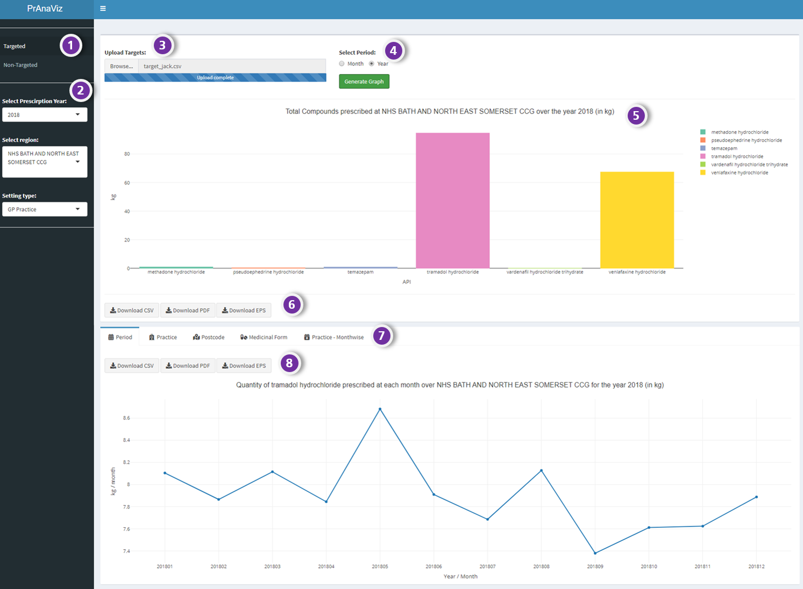
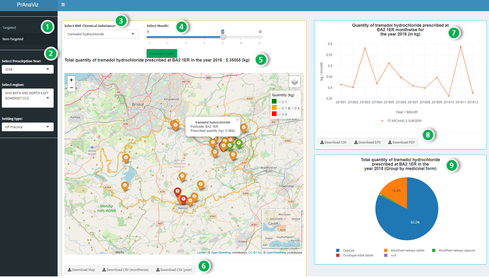

# PrAnaViz {#pranaviz}

## Introduction {#pranaviz-intro}

The aim of this tool is to visualise and analyse the prescription data to calculate total prescribed quantity of different APIs and to explore spatiotemporal trends of different APIs for wider use.

We have created, `PrAnaViz`, in a familiar **dashboard layout** with two tabs: (1) **Targeted API**, (2) **Non-targeted API**, to visualize total quantity of different APIs at CCG region with resolution to individual postcode. 


## Targeted Approach {#pranaviz-targeted}

- In this tab, user can **input a list of APIs**, and find out the **total prescription quantity** of each API in the selected year, at the selected CCG region, as in the Figure: \@ref(fig:pranaviz-targeted01).
- This tab also visualise the total quantity of **APIs** prescribed by  month, GP, Chemical form, and  Medicinal form for a CCG region in a selected year.


```{r pranaviz-targeted01, echo=FALSE, out.width='80%', fig.align='center', fig.fullwidth=TRUE, fig.cap='PrAna Targeted Approach.'}

```

*Option*         | *Remarks*
-----------------| ----------------------------------------------
1 | Select Targeted or Non-Targeted Approach
2 | Select Year, Region and Setting Type
3 | Upload targets i.e., APIs in `.csv` format
4 | Select monthwise or yearwise plots
5 | Plot generated based on user selection
6 | Download buttons to download the generated plot as `.pdf` or `.eps` and data as `.csv` format
7 | More insights on a selected API, visualise total prescribed quantity of the API per month, GP practice, postcode and medicinal form (click on a particular API on the barplot to generate these plots)
8 | Download buttons to download the generated plot as `.pdf` or `.eps` and data as `.csv` format

## Non-targeted Approach {#pranaviz-nontargeted}

- Total prescription quantity of an individual API at **different postcode per month** at a CCG region, can be rendered in this tab, as in the Figure: \@ref(fig:pranaviz-nontargeted01).
- The calculated total prescription quantity of an individual API at postcode level helps to find **the hotspots**.
- User can download data as **_.csv_** file and publication ready image **_.eps_** and **_.pdf_** files.

```{r pranaviz-nontargeted01, echo=FALSE, out.width='80%', fig.align='center', fig.fullwidth=TRUE, fig.cap='PrAna Non-targeted Approach.'}

```

*Option*         | *Remarks*
-----------------| ----------------------------------------------
1 | Select Targeted or Non-Targeted Approach
2 | Select Year, Region and Setting Type
3 | Select *API* in the `drop-down` menu
4 | Select a month
5 | Plot generated based on user selection, click on a particular postcode to generate further plots
6 | Download buttons to download the generated plot as an interactive `.html` document and data as `.csv` format
7 | Visualise total prescribed quantity of the API per month on the selected  postcode (click on a particular postoode on the plot to generate these plots)
8 | Download buttons to download the generated plot as `.pdf` or `.eps` and data as `.csv` format
9 | Visualise total prescribed quantity of the API per medicinal form on the selected postcode

\newpage